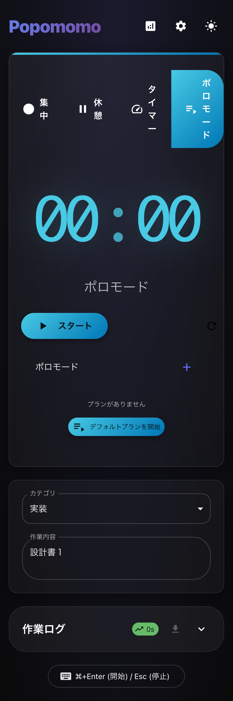
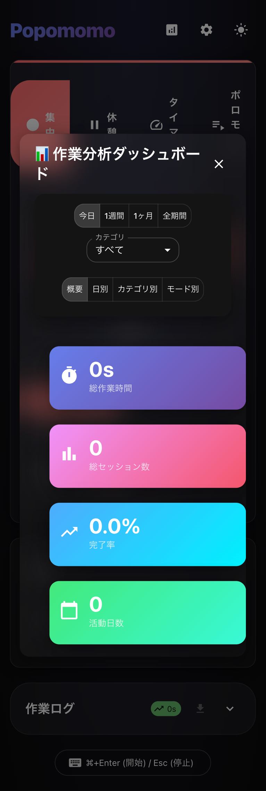

# 🍅 Popomomo

Tauri、React、Material-UIで構築されたモダンで機能豊富なポモドーロタイマーデスクトップアプリケーション。

## ✨ 機能

### 🎯 タイマーモード
- **集中モード** - カスタマイズ可能な集中セッション（1-60分）
- **休憩モード** - 短い休憩期間（1-15分）
- **タイマーモード** - 自由形式の時間追跡
- **ポモドーロプラン** - カスタム作業/休憩シーケンスの作成

### 📊 分析・統計
- 包括的な作業分析ダッシュボード
- 日別、月別、カテゴリ別、モード別の統計
- 視覚的な進捗追跡と完了率
- データフィルタリングとエクスポート機能

### 🗂️ 整理機能
- カスタムカテゴリ管理
- 削除可能な作業ログ追跡
- CSV出力機能
- タスク説明サポート

### 🎨 ユーザーエクスペリエンス
- モダンなグラスモーフィズムUIデザイン
- ダーク/ライトテーマサポート
- Framer Motionによるスムーズアニメーション
- システムトレイ統合（macOSメニューバー）
- サウンド通知
- キーボードショートカットサポート

### 💾 データ管理
- 信頼性の高いSQLiteデータベースストレージ
- localStorageからの自動移行
- リアルタイムデータ同期

## 🖼️ スクリーンショット

### メインタイマー画面

*モード選択付きメインタイマーインターフェース - 集中モード、休憩モード、タイマーモード、ポロモードプランの選択が可能*

### 分析ダッシュボード

*統計付き分析ダッシュボード - 日別、カテゴリ別、モード別の詳細な生産性追跡*


## 🚀 はじめ方

### 前提条件
- Node.js (v18以上)
- Rust (最新安定版)
- Tauri CLI

### インストール

1. リポジトリをクローン
```bash
git clone https://github.com/nobutokai/popomomo.git
cd popomomo
```

2. 依存関係をインストール
```bash
npm install
```

3. 開発モードで実行
```bash
npm run tauri dev
```

4. 本番用にビルド
```bash
npm run tauri build
```

## 🛠️ 技術スタック

- **フロントエンド**: React 18, TypeScript, Material-UI v6
- **デスクトップフレームワーク**: Tauri v2
- **データベース**: SQLite (Tauriプラグイン経由)
- **アニメーション**: Framer Motion
- **ビルドツール**: Vite
- **スタイリング**: カスタムテーマ付きMaterial-UI

## 📁 プロジェクト構造

```
popomomo/
├── src/
│   ├── components/          # Reactコンポーネント
│   │   ├── TimerDisplay.tsx
│   │   ├── AnalyticsDashboard.tsx
│   │   ├── WorkLogs.tsx
│   │   ├── CategoryManager.tsx
│   │   ├── PlanEditorDialog.tsx
│   │   └── PomodoroPlans.tsx
│   ├── hooks/              # カスタムReactフック
│   │   └── usePomodoroTimer.ts
│   ├── services/           # サービス層
│   │   ├── database.ts
│   │   ├── sound.ts
│   │   └── tray.ts
│   ├── types.ts            # TypeScript型定義
│   └── App.tsx
├── src-tauri/              # Tauri Rustバックエンド
│   ├── src/
│   │   ├── lib.rs
│   │   └── main.rs
│   └── Cargo.toml
├── public/                 # 静的アセット
├── docs/                   # ドキュメント・画像
│   └── images/
└── package.json
```

## 🎯 主要機能の説明

### ポモドーロプラン
集中時間と休憩時間を交互に組み合わせたカスタム作業シーケンスを作成できます。各プランは異なる時間と種類の複数ステップを持つことができます。

### 分析ダッシュボード
詳細な統計で生産性を追跡：
- **概要**: 総時間、セッション数、完了率、活動日数
- **日別ビュー**: 日ごとの内訳
- **カテゴリビュー**: 作業カテゴリ別統計
- **モードビュー**: タイマーモード別統計

### システム統合
- **macOSメニューバー**: システムトレイでのタイマー表示
- **バックグラウンド動作**: ウィンドウを閉じてもアプリが継続動作
- **サウンド通知**: タイマー完了時の音声フィードバック

## ⌨️ キーボードショートカット

- `⌘ + Enter` (macOS) / `Ctrl + Enter` (Windows/Linux) - タイマー開始
- `Escape` - タイマー停止

## 🗃️ データベース構造

アプリは以下のテーブルを持つSQLiteを使用：
- `categories` - 作業カテゴリ
- `work_logs` - タイマーセッション記録
- `pomodoro_plans` - カスタムプラン設定
- `settings` - ユーザー設定

## 🤝 コントリビューション

コントリビューションを歓迎します！プルリクエストをお気軽に送信してください。

### 開発環境のセットアップ

1. リポジトリをフォーク
2. フィーチャーブランチを作成 (`git checkout -b feature/素晴らしい機能`)
3. 変更をコミット (`git commit -m '素晴らしい機能を追加'`)
4. ブランチにプッシュ (`git push origin feature/素晴らしい機能`)
5. プルリクエストを開く

### コーディング規約
- すべての新しいコードにTypeScriptを使用
- 既存のコードスタイルと規約に従う
- 複雑なロジックにはコメントを追加
- 変更を十分にテストする

## 📝 ライセンス

このプロジェクトはMITライセンスの下でライセンスされています - 詳細は[LICENSE](LICENSE)ファイルを参照してください。

## 🙏 謝辞

- クロスプラットフォームデスクトップ開発に[Tauri](https://tauri.app/)を使用
- UIコンポーネントに[Material-UI](https://mui.com/)を使用
- アニメーションに[Framer Motion](https://www.framer.com/motion/)を使用
- アイコンに[Material Icons](https://mui.com/material-ui/material-icons/)を使用

## 🐛 バグレポート・機能リクエスト

バグの報告や新機能のリクエストには[GitHub Issues](https://github.com/nobutokai/popomomo/issues)ページをご利用ください。

## 🔄 変更履歴

### v1.0.0 (初回リリース)
- ✅ 複数タイマーモード（集中、休憩、タイマー、ポモドーロプラン）
- ✅ 包括的な統計付き分析ダッシュボード
- ✅ カスタムカテゴリ管理
- ✅ SQLiteデータベース統合
- ✅ システムトレイ統合
- ✅ ダーク/ライトテーマサポート
- ✅ サウンド通知
- ✅ CSV出力機能
- ✅ モダンなグラスモーフィズムUI

---

**生産性愛好家のために❤️で作られました**
